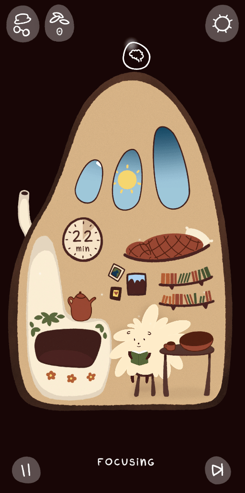
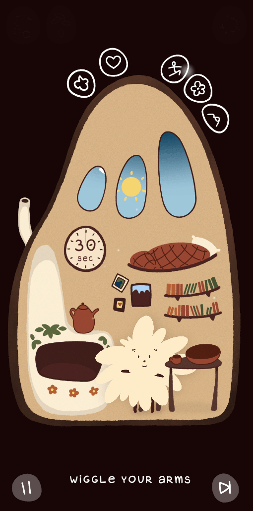
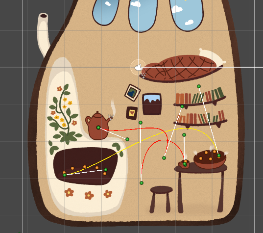
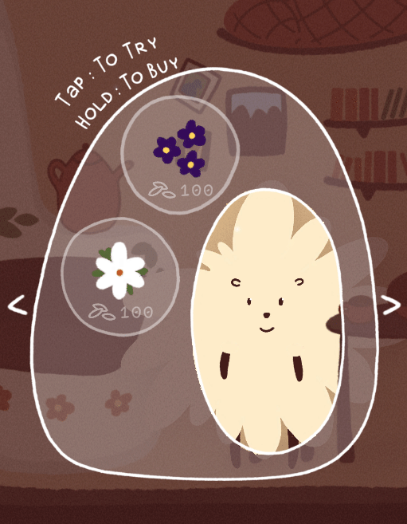
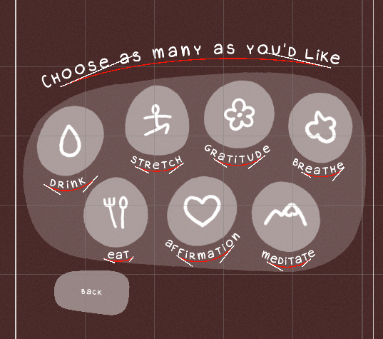

<h1>Hu's Lair</h1>

Hu is your cute companion! They live in their little house and are happy to accompany you during your day.

 

There are two modes.

<table>
  <tr>
    <td align="center">
      
Focus mode

    </td>
    <td align="center">
      
Self Care mode

    </td>
  </tr>
  <tr>
    <td align="center">
      
    </td>
    <td align="center">
      
    </td>
  </tr>
</table>

 

In your spare time, cook some buns and tea for them to enjoy :) The travel system for items uses own spline system. 

  
  

 

Dress them pretty with your hard-earned seeds (the in-game-currency). 

 

Choose from a variety of break activities for Hu to do alongside you! TextMeshPro is bent using own spline system. 

